# 🚨 BEACON – Emergency Safety & Offline Location System

**Emergency Location • SOS • Offline GPS • SMS • Trusted Circle • Security**

BEACON is an Android-based **Emergency Safety and Location System** developed using **Kotlin and XML**.

The application provides quick assistance during emergency situations using SOS alerts, GPS/GNSS location, cellular SMS, trusted contacts, emergency siren, vibration, security controls, activity logs, and device health monitoring.

---

## 📌 Project Overview

BEACON is developed as part of the **Mobile Application Development (MAD)** course.

During an emergency, users may not have access to mobile-data internet or enough time to manually contact multiple people.

BEACON provides multiple emergency and safety features in one Android application.

A major focus of BEACON is its **offline-oriented architecture**. GPS coordinates can be obtained without mobile-data internet, while cellular SMS can be used for emergency communication when SMS network coverage is available.

---

# 🎯 Objectives

* 🚨 Provide quick emergency assistance through SOS
* 📍 Obtain accurate GPS/GNSS coordinates
* 📩 Share emergency location through cellular SMS
* 👥 Maintain a secure Trusted Circle
* 📶 Reduce dependency on mobile-data internet
* 🔐 Protect location information from unauthorized users
* 📋 Maintain emergency and security activity logs
* ❤️ Monitor important BEACON system components

---

# ✨ Key Features

### 🚨 3-Second SOS Activation

Press and hold the **SOS button for 3 seconds** to activate emergency mode and prevent accidental activation.

When activated:

* 🚨 Emergency mode starts
* 🔊 Siren starts
* 📳 Device vibration is activated
* 📍 GPS coordinates are obtained
* 👥 Trusted contacts can be alerted
* 📋 Emergency activity is recorded

---

### 🔊 Siren & Vibration

Emergency mode activates:

* 🔊 Emergency siren
* 📳 Device vibration
* 🛑 SOS cancellation option

These features help attract nearby attention during an emergency.

---

### 📍 Live GPS / GNSS

BEACON provides detailed location information including:

* Latitude
* Longitude
* Estimated accuracy
* Altitude
* Location provider
* Last GPS update
* Copy coordinates
* Open location using map services

GPS coordinates can be obtained without mobile-data internet.

---

### 📩 SMS LOCATE System

A trusted contact can send:

`LOCATE`

BEACON verifies the sender before sharing location information.

```text
Incoming "LOCATE" SMS
          ↓
     Verify Sender
          ↓
   Trusted Circle
      ↙       ↘
 Trusted     Unknown
    ↓           ↓
 Get GPS      Block
    ↓
Generate Location
    ↓
Create Maps Link
    ↓
Send SMS Response
    ↓
Save Activity Log
```

---

### 👥 Trusted Circle

BEACON uses a **Trusted Circle Whitelist** to protect sensitive location information.

Users can:

* Add trusted contacts
* Set a primary contact
* Maintain verified contacts
* Send LOCATE requests
* Verify incoming requests
* Block unknown senders

Only authorized contacts can request sensitive location information.

---

### 🔐 Security & Privacy

BEACON includes:

* 🛡️ Trusted sender whitelist
* 🚫 Unknown sender blocking
* 🔑 Exact `LOCATE` keyword verification
* ⏱️ Anti-spam protection
* 🕵️ Stealth controls
* 📋 Security activity auditing

---

### 📋 Beacon Activity Log

The application records important events such as:

* 🚨 SOS activation
* 📍 GPS/location activities
* ✅ Successful trusted requests
* 🚫 Blocked unknown requests
* 📨 SMS location responses
* ❤️ Diagnostic activities

---

### ❤️ Health & Telemetry

BEACON monitors:

* 🛰️ GPS subsystem
* 📩 SMS availability
* 🔋 Battery status
* 📡 Cellular system
* ❤️ Overall BEACON health

---

# 📶 Offline Architecture

```text
🛰️ GPS / GNSS
      │
      ▼
Location Coordinates

📡 Cellular Network
      │
      ▼
SMS Communication

🌐 Internet
      │
      ▼
Online Map Services
```

**Mobile-data internet is not required for obtaining GPS coordinates.**

SMS communication still requires cellular SMS network coverage.

---

# 📲 BEACON Modules

| No. | Module                   | Purpose                                 |
| --- | ------------------------ | --------------------------------------- |
| 1   | 🏠 Home Dashboard        | System status and SOS access            |
| 2   | 🚨 Emergency SOS         | Siren, vibration and emergency dispatch |
| 3   | ⚙️ Beacon Control        | LOCATE keyword and SMS monitoring       |
| 4   | 👥 Trusted Circle        | Verified emergency contacts             |
| 5   | 📶 Offline Architecture  | GPS + cellular SMS operation            |
| 6   | 📍 GPS Tactical Location | Live GNSS coordinates and accuracy      |
| 7   | 📨 SMS Request Parser    | Validates incoming LOCATE requests      |
| 8   | 📤 Location Response     | Generates location SMS response         |
| 9   | 📋 Beacon Activity Log   | Emergency and security audit            |
| 10  | 🔐 Security & Privacy    | Whitelist and privacy controls          |
| 11  | ❤️ Health Diagnostics    | GPS, SMS and battery diagnostics        |
| 12  | 🔄 Complete Beacon Flow  | End-to-end BEACON architecture          |

---

# 🚨 SOS Workflow

```text
User Holds SOS Button
        │
        ▼
3-Second Countdown
        │
        ▼
   SOS Activated
        │
        ▼
Siren + Vibration
        │
        ▼
Get GPS Coordinates
        │
        ▼
Alert Trusted Contacts
        │
        ▼
Save Activity Log
```

---

# 🛠️ Technologies Used

| Technology              | Purpose                         |
| ----------------------- | ------------------------------- |
| Kotlin                  | Application logic               |
| XML                     | UI design                       |
| Android Studio          | Development environment         |
| Android SDK             | Android functionality           |
| Google Play Services    | Location services               |
| Fused Location Provider | GPS/GNSS location               |
| BroadcastReceiver       | SMS/event handling              |
| Android SMS APIs        | SMS communication               |
| MediaPlayer             | Emergency siren                 |
| Vibrator API            | Emergency vibration             |
| BatteryManager          | Battery monitoring              |
| SharedPreferences       | Local application data          |
| Intent                  | Navigation and external actions |

---

# 🔐 Permissions Used

The application uses Android permissions for:

* 📍 Fine Location
* 📍 Coarse Location
* 📩 Send SMS
* 📨 Receive SMS
* 📳 Vibration
* 👥 Contacts where required

---

# ⚠️ Challenges Faced

During development, some major challenges were:

* Implementing the 3-second SOS hold
* Getting accurate GPS coordinates
* Handling Android runtime permissions
* Working with GPS without mobile-data internet
* Receiving and processing SMS requests
* Verifying trusted contacts
* Blocking unauthorized senders
* Managing siren and vibration
* Handling different Android versions
* Maintaining activity logs
* Managing security and privacy controls

---

# 🧪 Testing

BEACON can be tested for:

* [ ] Application launch
* [ ] 3-second SOS activation
* [ ] SOS cancellation
* [ ] Emergency siren
* [ ] Emergency vibration
* [ ] GPS coordinate retrieval
* [ ] GPS accuracy
* [ ] Trusted contact management
* [ ] Primary contact selection
* [ ] LOCATE keyword detection
* [ ] Trusted sender verification
* [ ] Unknown sender blocking
* [ ] SMS location response
* [ ] Activity log generation
* [ ] Battery status
* [ ] Health diagnostics
* [ ] Offline GPS operation

---

# 📸 Application Screenshots

<p align="center">
  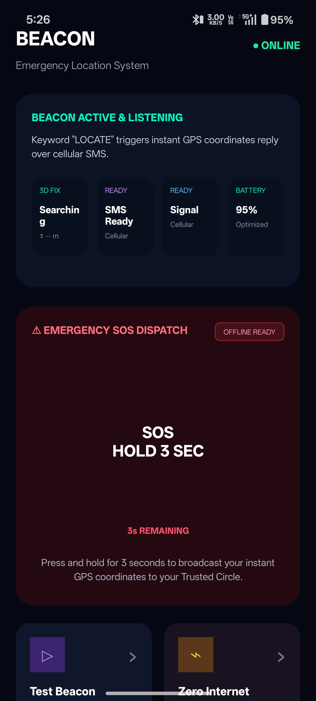
  
  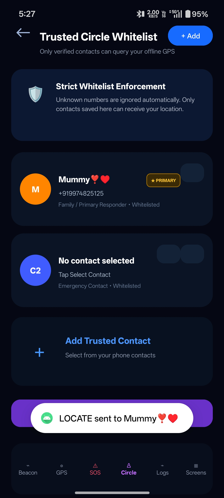
</p>

<p align="center">
  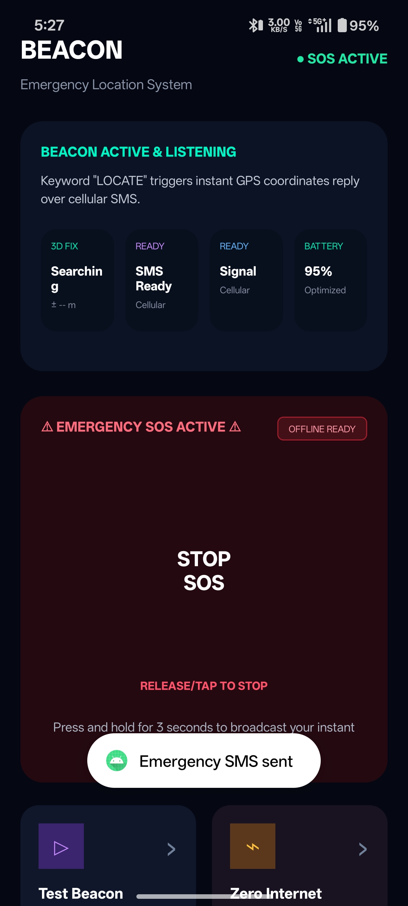
  
  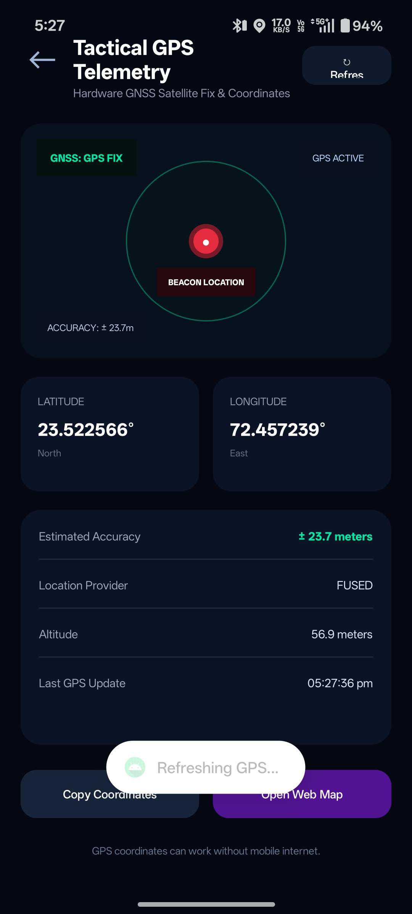
</p>

<p align="center">
  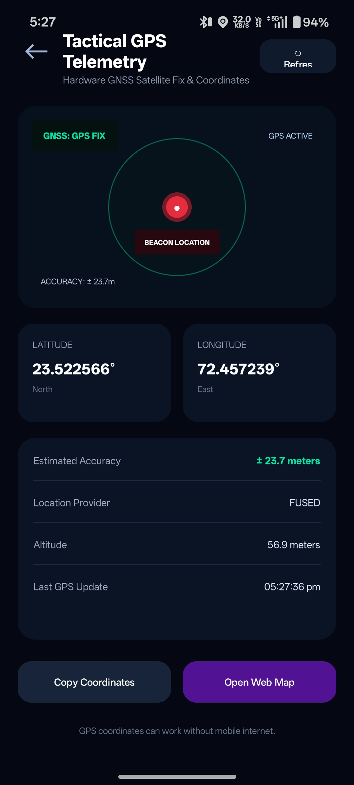
  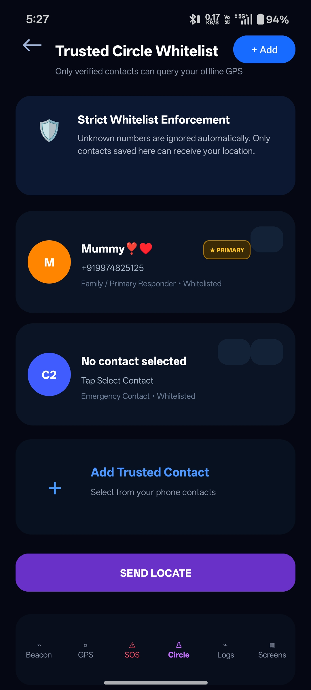
  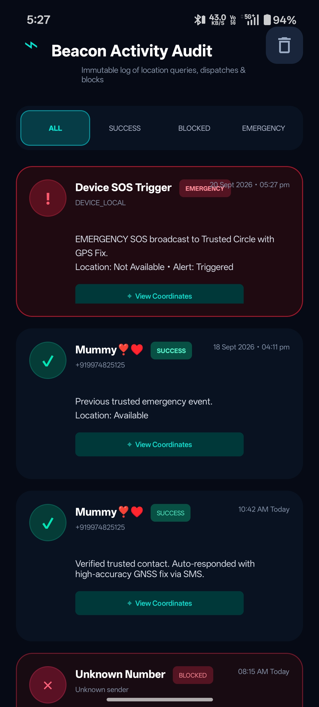
</p>

<p align="center">
  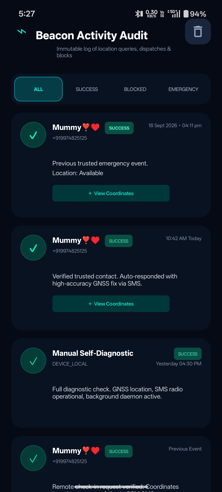
  
  
</p>

<p align="center">
  
  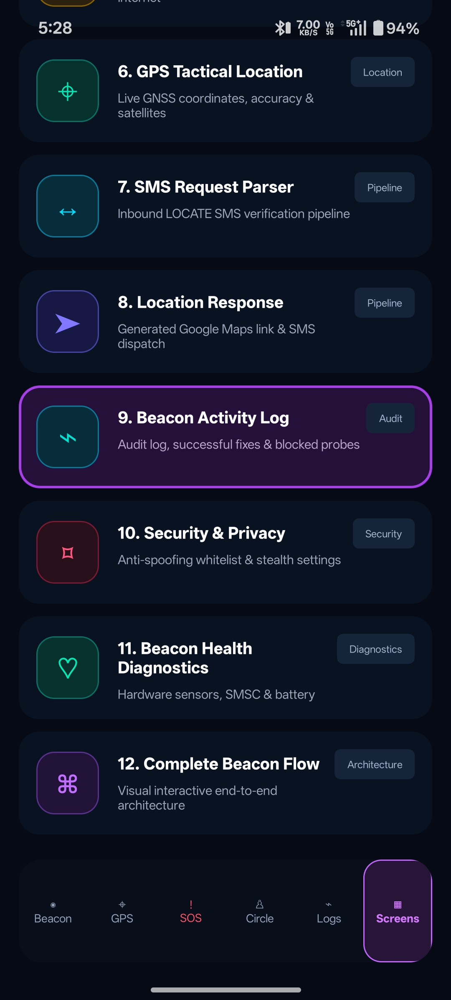
  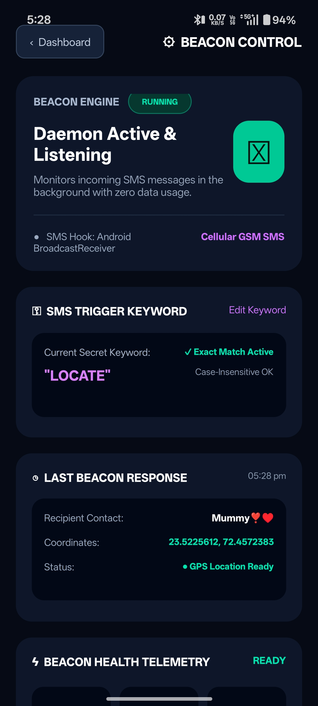
</p>

<p align="center">
  
  
  
</p>

<p align="center">
  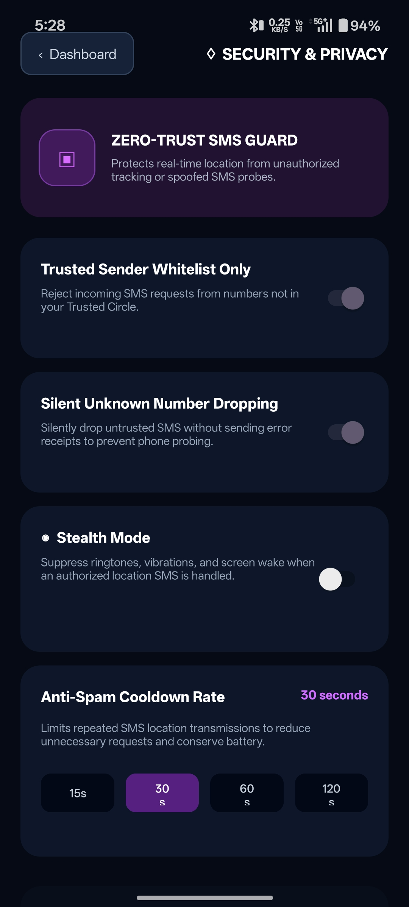
  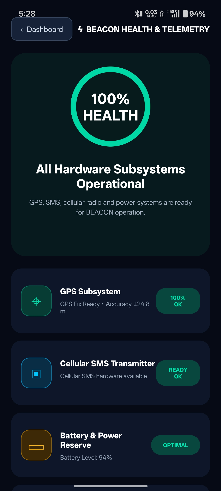
  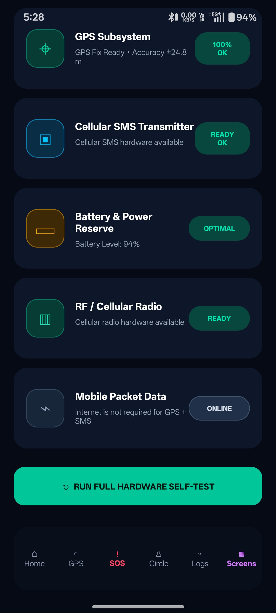
</p>

<p align="center">
  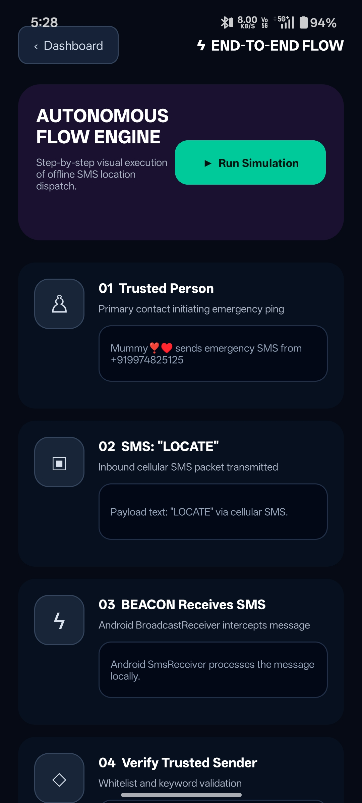
  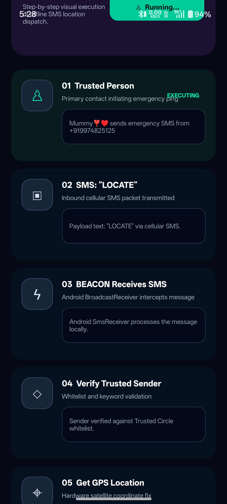
</p>

---

# 🚀 Future Scope

* 🎙️ Voice-activated SOS
* 📳 Shake-to-activate emergency mode
* 📍 Real-time location tracking
* 🧠 AI-based emergency detection
* 🚶 Fall detection
* ⌚ Smartwatch integration
* 🗺️ Location history
* 🔋 Improved background monitoring
* 🔔 Advanced emergency notifications
* 📞 Emergency service integration

---

# ⚙️ Installation

### 1. Clone Repository

```bash
git clone https://github.com/khaneshahimadri/24012011230_Khanesha_Himadri_Assignment-1_MAD.git
```

### 2. Open in Android Studio

Open the cloned project using **Android Studio**.

### 3. Sync Gradle

Allow Android Studio to download and synchronize the required dependencies.

### 4. Grant Permissions

Grant required permissions for location, SMS, vibration, and contacts where applicable.

### 5. Run

Connect a physical Android device and run the application.

> A physical Android device is recommended for testing GPS, SMS, cellular network, siren, and vibration functionality.

---

# 👩‍💻 Developed By

### Himadri Khanesha

**Enrollment No:** `24012011230`
**Class:** CE-I
**Batch:** I-2
**Subject:** Mobile Application Development (MAD)

**GitHub:**
https://github.com/khaneshahimadri

**Repository:**
https://github.com/khaneshahimadri/24012011230_Khanesha_Himadri_Assignment-1_MAD

---

# ⚠️ Disclaimer

BEACON is an **academic project developed for educational purposes**.

It demonstrates Android emergency communication, GPS/location, SMS, security, and safety concepts and should **not be considered a replacement for official emergency services**.

---

# 🚨 BEACON

### Emergency Assistance • Location • Communication • Safety

**Built with Kotlin ❤️ for Mobile Application Development**
