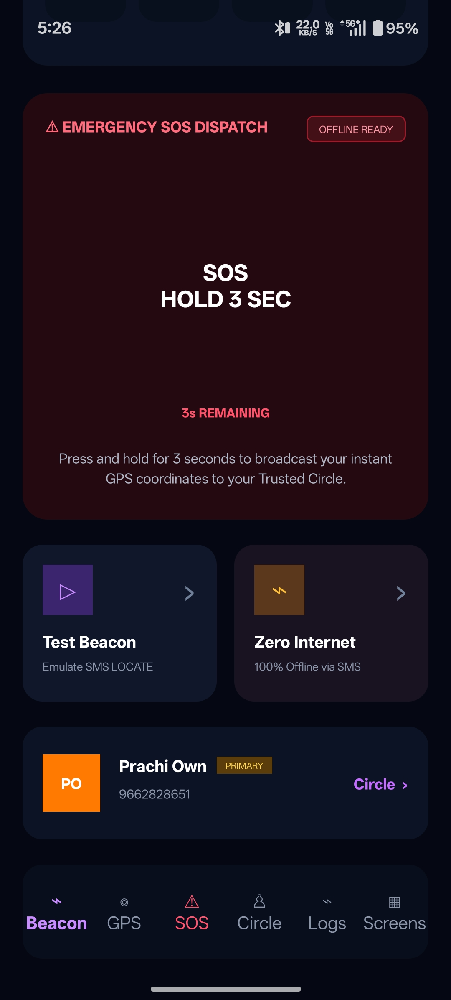
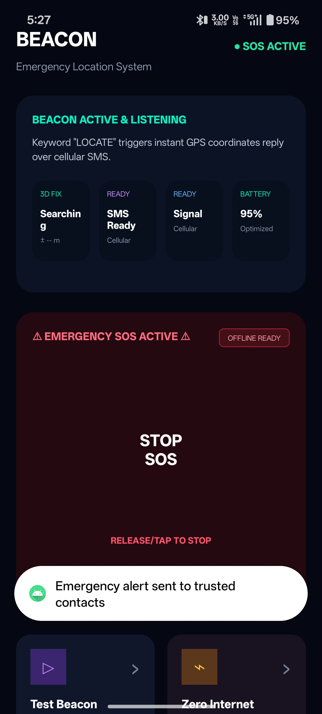
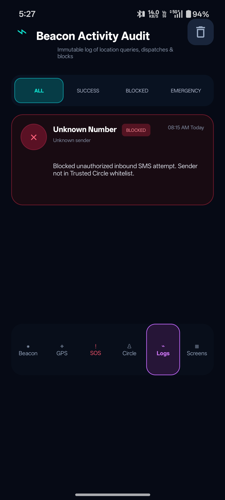
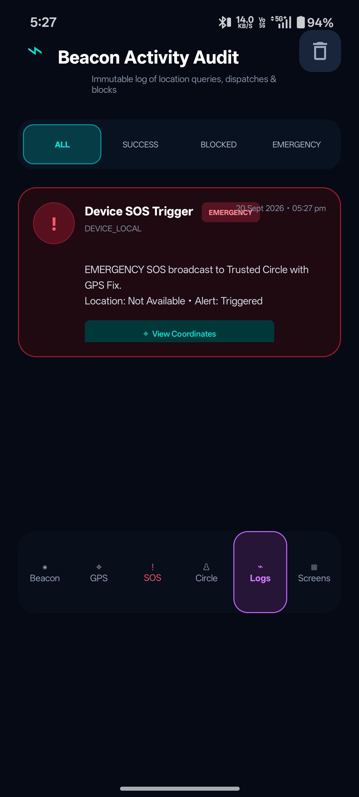
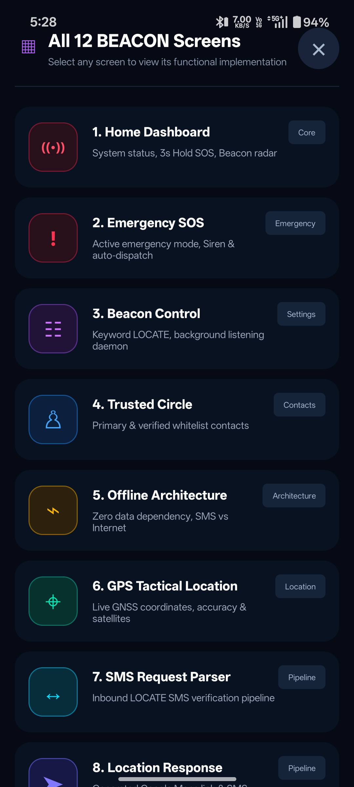
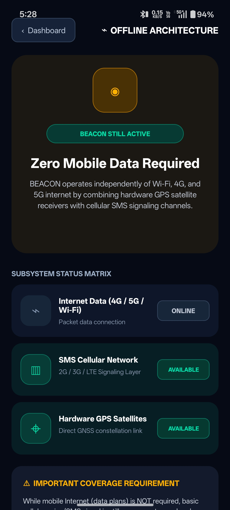
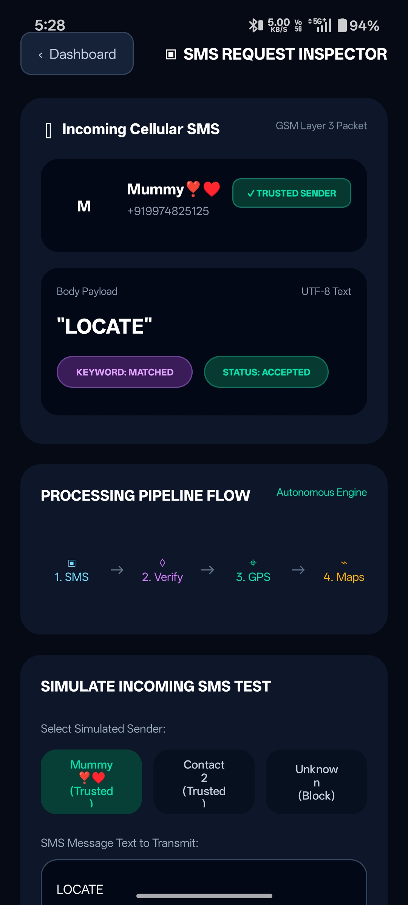
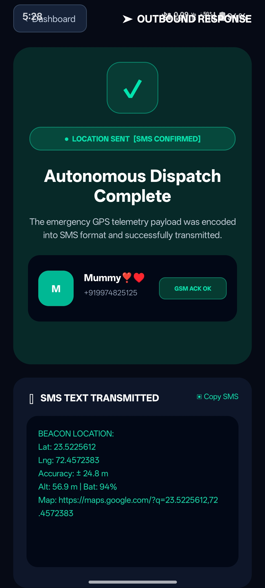

# 🚨 BEACON – Emergency Safety & Offline Location System

<p align="center">
  <b>Emergency Location • SOS • Offline GPS • SMS • Trusted Circle • Security</b>
</p>

BEACON is an **Android-based emergency safety and location application** developed using **Kotlin and XML**.

The application provides quick assistance during emergency situations using SOS alerts, GPS/GNSS location, cellular SMS, trusted contacts, emergency siren, vibration, security controls, activity logs, and system health monitoring.

---

## 📱 Project Overview

During an emergency, users may not always have access to mobile data or enough time to manually contact multiple people.

**BEACON** combines multiple emergency and safety features into a single Android application.

A major focus of BEACON is its **offline-oriented architecture**. GPS coordinates can be obtained without mobile-data internet, while cellular SMS can be used for emergency communication when SMS network coverage is available.

---

# ✨ Key Features

### 🚨 Emergency SOS

* 3-second hold to activate SOS
* Emergency siren
* Device vibration
* GPS location
* Trusted contact alerts
* Emergency activity logging

### 📍 GPS / GNSS Location

* Latitude and longitude
* Estimated accuracy
* Altitude
* Location provider
* Last GPS update
* Copy coordinates
* Open location using map services

### 📩 SMS LOCATE System

A trusted contact can send:

`LOCATE`

BEACON verifies the sender and can return the device's location through cellular SMS.

### 👥 Trusted Circle

* Add trusted contacts
* Select primary contact
* Verify incoming requests
* Block unknown senders
* Securely share location

### 🔐 Security & Privacy

* Trusted sender whitelist
* Unknown sender blocking
* Exact `LOCATE` keyword verification
* Anti-spam protection
* Security activity auditing

### 📋 Activity Log

* SOS activities
* GPS activities
* Trusted requests
* Blocked requests
* SMS responses
* Diagnostic activities

### ❤️ Health & Telemetry

* GPS subsystem
* SMS availability
* Battery status
* Cellular system
* Overall BEACON health

---

# 📶 Offline Architecture

```text id="d9ukge"
🛰️ GPS / GNSS
      │
      ▼
Location Coordinates

📡 Cellular Network
      │
      ▼
SMS Communication

🌐 Internet
      │
      ▼
Online Map Services
```

> GPS coordinates can be obtained without mobile-data internet. SMS functionality requires cellular SMS coverage.

---

# 📲 BEACON Modules

| No. | Module                   | Purpose                                 |
| --- | ------------------------ | --------------------------------------- |
| 1   | 🏠 Home Dashboard        | System status and SOS access            |
| 2   | 🚨 Emergency SOS         | Siren, vibration and emergency dispatch |
| 3   | ⚙️ Beacon Control        | LOCATE keyword and SMS monitoring       |
| 4   | 👥 Trusted Circle        | Verified emergency contacts             |
| 5   | 📶 Offline Architecture  | GPS + cellular SMS operation            |
| 6   | 📍 GPS Tactical Location | Live GNSS coordinates                   |
| 7   | 📨 SMS Request Parser    | Validates LOCATE requests               |
| 8   | 📤 Location Response     | Generates location SMS response         |
| 9   | 📋 Activity Log          | Emergency and security audit            |
| 10  | 🔐 Security & Privacy    | Whitelist and privacy controls          |
| 11  | ❤️ Health Diagnostics    | GPS, SMS and battery diagnostics        |
| 12  | 🔄 Complete Beacon Flow  | End-to-end BEACON architecture          |

---

# 🚨 SOS Workflow

```text id="ig16ds"
User Holds SOS Button
        │
        ▼
3-Second Countdown
        │
        ▼
   SOS Activated
        │
        ▼
Siren + Vibration
        │
        ▼
Get GPS Coordinates
        │
        ▼
Alert Trusted Contacts
        │
        ▼
Save Activity Log
```

---

# 🛠️ Technology Stack

| Technology              | Purpose                         |
| ----------------------- | ------------------------------- |
| Kotlin                  | Android application logic       |
| XML                     | User interface design           |
| Android Studio          | Development environment         |
| Android SDK             | Android functionality           |
| Google Play Services    | Location services               |
| Fused Location Provider | GPS/GNSS location               |
| BroadcastReceiver       | SMS and event handling          |
| Android SMS APIs        | SMS communication               |
| MediaPlayer             | Emergency siren                 |
| Vibrator API            | Emergency vibration             |
| BatteryManager          | Battery monitoring              |
| SharedPreferences       | Local application data          |
| Intent                  | Navigation and external actions |

---

# 📸 Application Screenshots

<p align="center">
  
  
  
</p>

<p align="center">
  
  
  
</p>

<p align="center">
  
  
  
</p>

<p align="center">
  
  
  
</p>

<p align="center">
  
  
  
</p>

<p align="center">
  
  
  
</p>

<p align="center">
  
  
  
</p>

<p align="center">
  
  
</p>

---

# 🌟 Advantages

* 🚨 Quick SOS activation
* 📍 GPS/GNSS location support
* 📩 SMS-based emergency communication
* 📶 Offline-oriented functionality
* 👥 Trusted Circle security
* 🚫 Unknown sender blocking
* 🔊 Emergency siren
* 📳 Emergency vibration
* 📋 Activity auditing
* 🔋 Battery monitoring
* 🔐 Privacy-focused location sharing

---

# ⚠️ Limitations

* SMS depends on cellular network availability.
* GPS accuracy depends on device and surroundings.
* Required Android permissions must be granted.
* Online maps may require internet connectivity.
* Background functionality may be affected by Android battery optimization.

---

# ⚠️ Challenges Faced

During the development of BEACON, several challenges were encountered:

- 📍 **GPS Location Accuracy** – Getting accurate and updated GPS coordinates.
- 📩 **SMS Handling** – Sending, receiving, and processing `LOCATE` messages correctly.
- 🔐 **Permission Management** – Handling location, SMS, and other runtime permissions.
- 👥 **Trusted Contact Verification** – Ensuring location is shared only with authorized contacts.
- 🚫 **Unknown Sender Blocking** – Preventing unauthorized location requests.
- 🚨 **SOS Implementation** – Implementing the 3-second hold mechanism to avoid accidental activation.
- 🔊 **Siren & Vibration** – Managing emergency siren and vibration during SOS mode.
- 📶 **Offline Functionality** – Making important features work without mobile-data internet.
- 🔋 **Background Restrictions** – Handling Android battery optimization and background execution limitations.
- 📋 **Activity Logging** – Recording emergency, location, and security activities properly.

-------


# 🚀 Future Enhancements

* 🎙️ Voice-activated SOS
* 📳 Shake-to-activate SOS
* 📍 Real-time location tracking
* 🧠 AI-based emergency detection
* 🚶 Fall detection
* ⌚ Smartwatch integration
* 👨‍👩‍👧 Family safety monitoring
* 🗺️ Location history
* 🔔 Advanced emergency notifications
* 📞 Emergency service integration
* ☁️ Optional cloud synchronization

  --------

# 🧪 Testing Checklist

* [ ] Application launch
* [ ] 3-second SOS activation
* [ ] SOS cancellation
* [ ] Emergency siren
* [ ] Emergency vibration
* [ ] GPS coordinate retrieval
* [ ] GPS accuracy
* [ ] Trusted contact management
* [ ] Primary contact selection
* [ ] LOCATE keyword detection
* [ ] Trusted sender verification
* [ ] Unknown sender blocking
* [ ] SMS location response
* [ ] Activity log generation
* [ ] Battery status
* [ ] Health diagnostics
* [ ] Offline GPS operation

---

# 👩‍💻 Developed By

### Himadri Khanesha

**Enrollment No:** `24012011230`
**Class:** CE-I
**Batch:** I-2
**Subject:** Mobile Application Development (MAD)

**GitHub:**
https://github.com/khaneshahimadri

**Project Repository:**
https://github.com/khaneshahimadri/24012011230_Khanesha_Himadri_Assignment-1_MAD

---


# 🚨 BEACON

### Emergency Assistance • Location • Communication • Safety

**Built with Kotlin ❤️ for Mobile Application Development**

</p>
